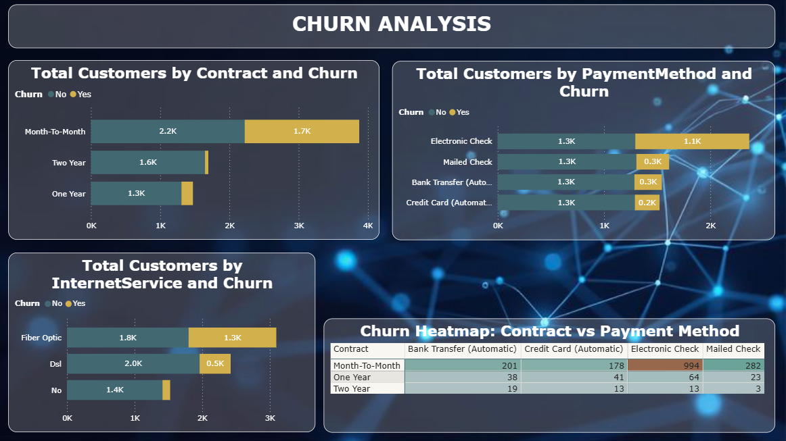

# 📉 Customer Churn Analysis Dashboard (Power BI)

## 1. Project Title / Headline
**Customer Churn Analysis using Power BI**

---

## 2. Short Description / Purpose
This project focuses on analyzing customer churn patterns to identify the key factors that influence customer attrition.  
The objective is to understand how churn varies based on **contract type, payment method, and internet service**, and to highlight high-risk customer segments through interactive visualizations.

The dashboard helps organizations identify churn drivers and supports data-driven decision-making for customer retention strategies.

---

## 3. Tech Stack
- **Power BI Desktop** – Data visualization and dashboard development  
- **DAX (Data Analysis Expressions)** – Measures for churn analysis  
- **Power Query Editor** – Data cleaning and transformation  
- **Excel / CSV** – Data source format  

---

## 4. Data Source
- **Telco Customer Churn Dataset**
- Key fields used:
  - Customer ID
  - Churn (Yes/No)
  - Contract Type
  - Payment Method
  - Internet Service

*(Dataset used for academic and learning purposes.)*

---

## 5. Features

### 📊 Churn by Contract Type
- Stacked bar chart showing churn distribution across:
  - Month-to-Month
  - One-Year
  - Two-Year contracts
- Identifies higher churn in short-term contracts.

---

### 💳 Churn by Payment Method
- Visual comparison of churn across different payment methods.
- Highlights behavioral patterns associated with customer attrition.

---

### 🌐 Churn by Internet Service
- Analyzes churn variation across Internet service types (DSL, Fiber, No Internet).
- Helps identify service-related risk factors.

---

### 🔥 Churn Heatmap (Contract vs Payment Method)
- Matrix visual with conditional background color formatting.
- Darker colors indicate higher churn concentration.
- Helps identify high-risk combinations of contract type and payment method.

---

### 🎨 Professional Dashboard Design
- Dark theme layout for better readability
- Clear titles and data labels
- Structured visual arrangement for easy interpretation

---

## 6. Screenshot
📷 **Churn Analysis Dashboard Preview**

---

## 📌 Conclusion
The Churn Analysis dashboard provides deep insights into customer attrition patterns by identifying the key factors associated with churn. The use of stacked bar charts and heatmap visualization enables quick identification of high-risk customer segments, supporting effective retention planning.

---

## 🚀 Future Scope
- Churn rate analysis instead of churn count
- Predictive churn modeling using machine learning
- Integration with real-time customer data
